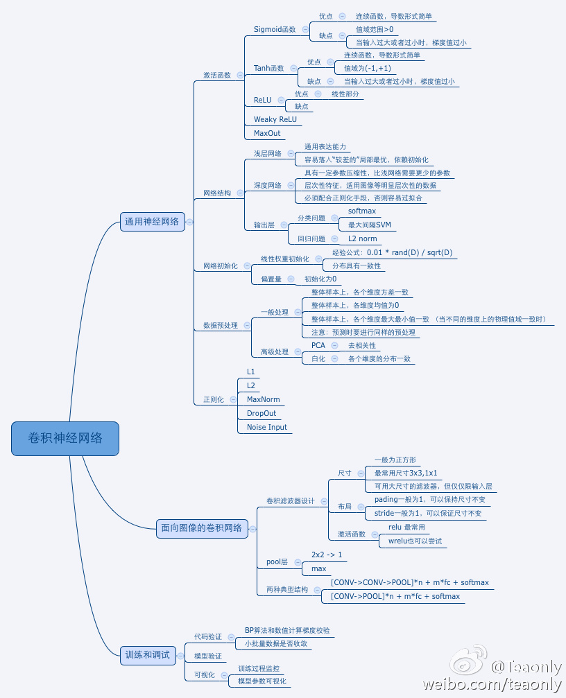

# my-first-cnn  
若不算之前对某些框架和包的简单使用，这是我的第一个神经网络实践项目——“我的第一个卷积网络”。

## 介绍  
其中，主要借助了 Python 的数据处理库 `numpy` 和图像处理库 `matplotlib`（类似MATLAB） 。下面这幅图是卷积网络的技术摘要（来自网络）。  

## 目前实现的有：  
1. 图片可视化模块（`./mycnn/class_painter_by_ndarray.py`）。已实现单一或多组图片的显示，保存。  
2. 数据加载模块（`./mycnn/class_read_raw_data.py`）。已实现把数据文件夹（`./data/input/`）下压缩过的图片数据加载到内存中（考虑到数据库存储比较麻烦，二进制流或图片数据库，所以不采用）。
3. 参数加载模块（`./mycnn/class_load_parameter_from_config.py`）。已实现把配置文件（`./config.ini`）中的参数数据加载到内存中，供程序后续执行使用。
4. 网络创建模块（`./mycnn/class_create_network.py`）。已实现卷积函数（`convolution(self, input_matrix, conv_operator_array = np.array([[1, 0, 1], [0, 1, 0], [1, 0, 1]]))`），部分激活函数（sigmoid，softplus，tanh）。
